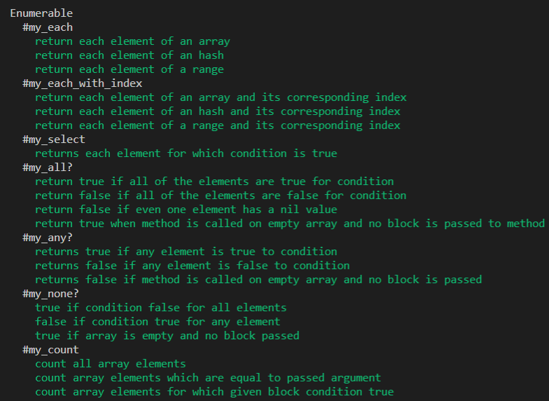
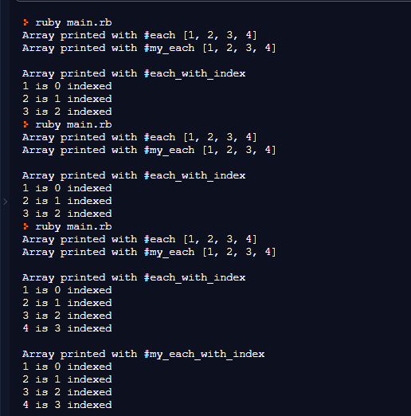

# Enumerables (Own implementation of some of Enumerables methods)

              

- We implemented #my_each, #my_each_with_index, #my_select, #my_all?, #my_any?, #my_none?, #my_count, #my_map, #my_inject
These methods are coded without using any Enumerable library method.

## Rspec Testing

- Spec tests using Rspec have been added in spc folder for all the enumerable methods
- Each method has a separate describe block and each testing aspect is covered with it block
- Used describe block, it block, expect and eql methods.
- Variables for testing purpose are created with let
- You can run the tests by simply running rspec or rspec --format documentation for more formated results on command line

## Built With

- Ruby
- Ruby Core API, Rspec, Rubocop, Cammand Line, Git & Github

## Live Demo

[Live Demo Link](https://repl.it/@SajjadAhmad14/MadCriminalOs#main.rb)

## Getting Started

**You can clone or fork the project and start using it in your own projects.**

## Authors

👤 **Sajjad Ahmad**

- Github: [@githubhandle](https://github.com/SajjadAhmad14)
- Twitter: [@twitterhandle](https://twitter.com/Sajjad_Ahmad14)
- Linkedin: [linkedin](https://linkedin.com/sajjad-ahmad-86102117a/)

👤 **Tadeua Sarro**

- Github: [@githubhandle](https://github.com/tadeuasarro)
- Twitter: [@twitterhandle](https://twitter.com/tadeuasarro)
- Linkedin: [linkedin](https://linkedin.com/tadeuasarro)

## 🤝 Contributing

Contributions, issues and feature requests are welcome!

Feel free to check the [issues page](https://github.com/SajjadAhmad14/Enumerables/issues).

## Show your support

Give a ⭐️ if you like this project!

## Acknowledgments

- Hat tip to anyone whose code was used
- Inspiration
- etc
